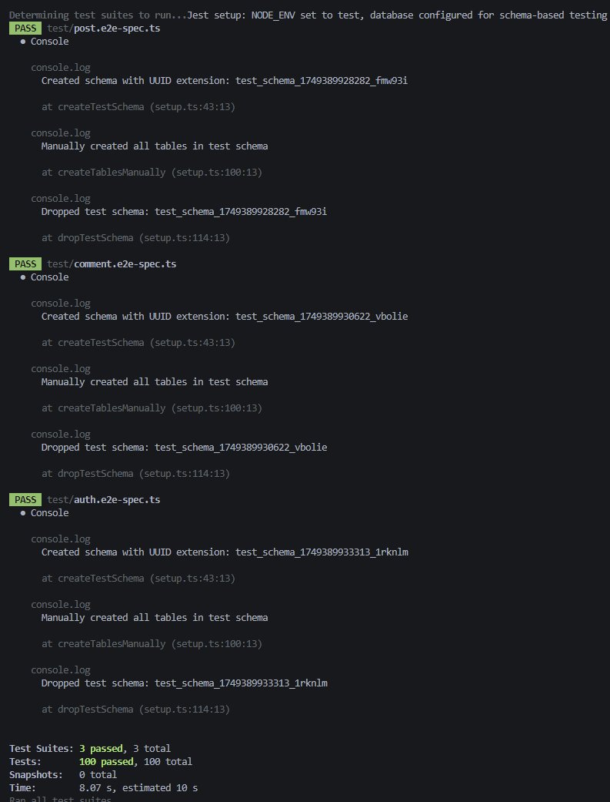

# nextjs-nestjs-blog-template

A full-stack blog platform built with **Next.js** (Frontend) and **NestJS** (Backend), featuring authentication, CRUD operations for posts and comments, search functionality, and category filtering.

## 📁 Project Structure

```
datawow-interview-2/
├── backend/                      # NestJS API Backend
│   ├── src/
│   │   ├── common/              # Shared utilities
│   │   │   ├── decorators/      # Custom decorators
│   │   │   ├── filters/         # Exception filters
│   │   │   ├── guards/          # Auth & validation guards
│   │   │   ├── interceptors/    # Request/response interceptors
│   │   │   ├── logging/         # Logging configuration
│   │   │   ├── middleware/      # Custom middleware
│   │   │   ├── pagination/      # Pagination utilities
│   │   │   └── pipes/           # Data transformation pipes
│   │   ├── config/              # App configuration
│   │   ├── database/            # Database setup
│   │   │   ├── entities/        # TypeORM entities
│   │   │   ├── migrations/      # Database migrations
│   │   │   └── seeds/           # Database seeds
│   │   ├── modules/             # Feature modules
│   │   │   ├── auth/            # Authentication module
│   │   │   │   ├── dto/         # Data transfer objects
│   │   │   │   └── strategies/  # Passport strategies
│   │   │   ├── comments/        # Comments module
│   │   │   │   └── dto/
│   │   │   ├── posts/           # Posts module
│   │   │   │   └── dto/
│   │   │   ├── shared/          # Shared module
│   │   │   └── users/           # Users module
│   │   │       └── dto/
│   │   └── main.ts              # Application entry point
│   ├── test/                    # E2E tests
│   ├── .env.example             # Environment variables template
│   ├── docker-compose.yml       # PostgreSQL setup
│   ├── package.json             # Dependencies & scripts
│   └── tsconfig.json           # TypeScript configuration
│
├── frontend/                    # Next.js Frontend
│   ├── app/                     # App Router pages
│   │   ├── (board)/            # Layout group for main app
│   │   │   ├── blog/           # Blog listing page
│   │   │   ├── create-post/    # Post creation page
│   │   │   ├── home/           # Home page
│   │   │   └── posts/          # Post details pages
│   │   │       └── [id]/       # Dynamic post page
│   │   ├── api/                # API routes
│   │   │   └── auth/           # NextAuth API routes
│   │   │       └── [...nextauth]/
│   │   ├── login/              # Login page
│   │   ├── layout.tsx          # Root layout
│   │   └── page.tsx            # Root page
│   ├── components/             # React components
│   │   ├── auth/               # Authentication components
│   │   ├── common/             # Common UI components
│   │   ├── features/           # Feature-specific components
│   │   │   ├── comments/       # Comment components
│   │   │   ├── posts/          # Post components
│   │   │   └── search/         # Search components
│   │   ├── layout/             # Layout components
│   │   ├── shared/             # Shared components
│   │   └── ui/                 # Base UI components
│   ├── lib/                    # Utility libraries
│   │   └── hooks/              # Custom React hooks
│   ├── providers/              # Context providers
│   ├── queries/                # React Query hooks
│   ├── services/               # API service layer
│   ├── types/                  # TypeScript type definitions
│   ├── .env.example            # Environment variables template
│   ├── middleware.ts           # Next.js middleware
│   ├── package.json            # Dependencies & scripts
│   └── next.config.ts          # Next.js configuration
│
├── test-results/               # Test screenshots & reports
├── .gitignore                  # Git ignore rules
└── README.md                   # Project documentation
```

## 🚀 Quick Start

### Prerequisites

- **Node.js** (v20 or higher)
- **pnpm** (v9 or higher) - `npm install -g pnpm`
- **Docker** (for PostgreSQL database)
- **Git**

### 1. Clone the Repository

```bash
git clone <repository-url>
cd datawow-interview
```

### 2. Database Setup

Start the PostgreSQL database using Docker:

```bash
cd backend
docker-compose up -d
```

This will start a PostgreSQL database on port 5432 with the following default credentials:
- **Database:** `api_db`
- **Username:** `postgres` 
- **Password:** `password`

### 3. Backend Setup

```bash
# Navigate to backend directory
cd backend

# Install dependencies
pnpm install

# Copy environment variables
cp .env.example .env

# Edit .env file if needed (optional - defaults should work)

# Start the development server
pnpm run dev
```

The backend API will be available at `http://localhost:5000`

### 4. Frontend Setup

```bash
# Navigate to frontend directory (from project root)
cd frontend

# Install dependencies
pnpm install

# Copy environment variables
cp .env.example .env.local

# Edit .env.local if needed (optional - defaults should work)

# Start the development server
pnpm run dev
```

### 5. Access the Application

- **Frontend:** http://localhost:3000
- **Backend API:** http://localhost:5000
- **API Documentation:** http://localhost:5000/api-docs (Swagger UI)

## 🧪 Testing Guide

### Backend Testing

The backend includes comprehensive unit and E2E tests with high coverage requirements (90% threshold).

#### Running Tests

```bash
cd backend

# Unit Tests Only
pnpm run test:unit        # Run unit tests
pnpm run test:unit:cov    # Run unit tests with coverage

# E2E Tests Only  
pnpm run test:e2e         # Run E2E tests
pnpm run test:e2e:cov     # Run E2E tests with coverage

# All Tests
pnpm run test:all         # Run both unit and E2E tests with coverage
pnpm run test:watch       # Run tests in watch mode for development
```

#### Test Structure

- **Unit Tests:** Located in `src/**/*.spec.ts` files alongside source code
- **E2E Tests:** Located in `test/**/*.e2e-spec.ts` files
- **Coverage Reports:** Generated in `coverage/` directory
- **Test Configuration:** Defined in `package.json` jest config

#### Coverage Requirements

The project maintains high code quality with:
- **90% branch coverage**
- **90% function coverage** 
- **90% line coverage**
- **90% statement coverage**

#### What's Tested

✅ **Authentication Flow**
- User login/logout
- JWT token validation
- Protected route access

✅ **Posts CRUD Operations**
- Create, read, update, delete posts
- Post validation and error handling
- Authorization (users can only edit their own posts)

✅ **Comments CRUD Operations**
- Create, read, update, delete comments
- Comment validation and error handling
- Authorization (users can only edit their own comments)

✅ **Search & Filtering**
- Search posts by title/content
- Filter posts by category
- Pagination functionality

✅ **Error Handling**
- Input validation errors
- Authentication errors
- Authorization errors
- Database constraint violations

### Database for Testing

The tests use the same PostgreSQL database configured in `docker-compose.yml`. Make sure it's running before executing tests:

```bash
# Start database (if not already running)
docker-compose up -d

# Verify database is running
docker-compose ps
```

### Viewing Test Results

After running tests with coverage:

```bash
# Open coverage report in browser
open coverage/lcov-report/index.html   # macOS
start coverage/lcov-report/index.html  # Windows
xdg-open coverage/lcov-report/index.html # Linux
```

## 🌐 Environment Configuration

### Backend Environment Variables

Copy `backend/.env.example` to `backend/.env` and configure:

```env
# Server Configuration
NODE_ENV=development
PORT=5000
API_PREFIX=api
CORS_ORIGIN=http://localhost:3000

# JWT Configuration  
JWT_SECRET=super-long-secret-literally-so-long
JWT_EXPIRES_IN=7d

# Database Configuration
DATABASE_HOST=localhost
DATABASE_PORT=5432
DATABASE_USERNAME=postgres
DATABASE_PASSWORD=password
DATABASE_NAME=api_db
DATABASE_SYNCHRONIZE=true
DATABASE_LOGGING=true

# Logging Configuration
LOG_LEVEL=debug
LOG_DIRECTORY=logs
```

### Frontend Environment Variables

Copy `frontend/.env.example` to `frontend/.env.local` and configure:

```env
# NextAuth Configuration
NEXTAUTH_SECRET=your-secret-key-here
NEXTAUTH_URL=http://localhost:3000

# API Configuration
NEXT_PUBLIC_API_URL=http://localhost:5000
NEXT_PUBLIC_API_BASE_PATH=/api/v1
```

## 🚨 Error Handling System

The frontend implements a sophisticated error handling system that provides consistent user experience across the application.

### Architecture Overview

```
┌─────────────────┐    ┌─────────────────┐    ┌─────────────────┐
│   API Client    │────│ Error Provider  │────│  Sonner Toast   │
│   (apiClient)   │    │ (Global Handler)│    │  (UI Display)   │
└─────────────────┘    └─────────────────┘    └─────────────────┘
         │                       │                       │
         │              ┌─────────────────┐              │
         └──────────────│  Custom Hooks   │──────────────┘
                        │ (useErrorHandling)│
                        └─────────────────┘
```

### Core Components

#### 1. **API Client (`services/apiClient.ts`)**

The centralized HTTP client that automatically handles all API communication and error transformation:

```typescript
// Custom error classes for type-safe error handling
export class ApiError extends Error {
  constructor(
    public statusCode: number,
    public error: string,
    public path: string,
    public requestId?: string,
    public errorCode?: string
  ) { /* ... */ }
}

export class ValidationError extends ApiError {
  constructor(
    statusCode: number,
    error: string,
    path: string,
    public validationErrors: string[],
    public fieldErrors?: Record<string, string[]>
  ) { /* ... */ }
}
```

**Key Features:**
- **Automatic Authentication:** Injects JWT tokens into requests
- **Response Unwrapping:** Extracts data from backend `ApiResponse<T>` wrapper
- **Error Transformation:** Converts Axios errors to typed custom errors
- **Global Error Handling:** Routes errors to the global error handler
- **Timeout Protection:** 10-second request timeout with proper error handling

#### 2. **Error Handling Provider (`providers/ErrorHandlingProvider.tsx`)**

React context provider that manages global error handling behavior:

```typescript
export type ErrorDisplayMode = 'toast' | 'silent' | 'custom';

interface ErrorHandlingContextType {
  setErrorMode: (mode: ErrorDisplayMode) => void;
  handleError: (error: ApiError | ValidationError, customHandler?: Function) => void;
}
```

**Error Display Modes:**
- **`toast`** (default): Shows user-friendly toast notifications
- **`silent`**: Logs errors without UI feedback
- **`custom`**: Allows components to handle errors manually

#### 3. **Toast Notifications (Sonner Integration)**

Smart error display system that provides contextual feedback:

**Validation Errors:**
```typescript
// Field-specific validation errors
if (error.fieldErrors) {
  const fieldMessages = Object.entries(error.fieldErrors)
    .map(([field, messages]) => `${field}: ${messages.join(', ')}`)
    .join('\n');
  
  toast.error('Validation Error', {
    description: fieldMessages,
    duration: 5000,
  });
}
```

**HTTP Status Error Mapping:**
- `400` → "Bad Request"
- `401` → "Unauthorized" (triggers logout)
- `403` → "Forbidden"
- `404` → "Not Found"
- `409` → "Conflict"
- `422` → "Validation Error"
- `500` → "Server Error"

### Usage Patterns

#### 1. **Default Global Handling**

Most API calls automatically display errors to users:

```typescript
// This will show a toast if an error occurs
const posts = await apiClient.get<Post[]>('/posts');
```

#### 2. **Custom Error Handling**

For specific scenarios requiring custom error handling:

```typescript
const { withCustomErrorHandling } = useCustomErrorHandling();

const result = await withCustomErrorHandling(
  () => apiClient.post('/posts', postData),
  (error) => {
    if (error.statusCode === 409) {
      setConflictError('A post with this title already exists');
    } else {
      setGeneralError(error.message);
    }
  }
);
```

#### 3. **Silent Error Handling**

For background operations where UI feedback isn't needed:

```typescript
const { withSilentErrors } = useCustomErrorHandling();

// This will log errors but not show toasts
const data = await withSilentErrors(
  () => apiClient.get('/user/preferences')
);
```

#### 4. **Temporary Global Disable**

For operations requiring complete custom control:

```typescript
const apiWithoutGlobal = await apiClient.withoutGlobalErrorHandling();
try {
  const result = await apiWithoutGlobal.post('/sensitive-operation', data);
  // Handle success
} catch (error) {
  // Handle error completely manually
}
```

### Error Types & Handling

#### **Network Errors**
```typescript
// Connection issues, timeouts
ApiError {
  statusCode: 0,
  error: "Network error occurred",
  path: "unknown"
}
```

#### **Validation Errors**
```typescript
// Backend validation failures
ValidationError {
  statusCode: 422,
  error: "Validation failed",
  validationErrors: ["Title is required", "Content must be at least 10 characters"],
  fieldErrors: {
    "title": ["Title is required"],
    "content": ["Content must be at least 10 characters"]
  }
}
```

#### **Authentication Errors**
```typescript
// Unauthorized access - triggers automatic logout
ApiError {
  statusCode: 401,
  error: "Unauthorized",
  path: "/api/v1/posts"
}
// Automatically redirects to login page
```

### Configuration

The error handling system is configured in the root providers:

```typescript
// app/providers.tsx
<ErrorHandlingProvider defaultMode="toast">
  {children}
  <Toaster
    position="top-right"
    expand={true}
    richColors
    closeButton
  />
</ErrorHandlingProvider>
```

### Benefits

✅ **Consistent UX:** All errors display consistently across the app  
✅ **Type Safety:** Strongly typed error objects with full TypeScript support  
✅ **Flexible Control:** Multiple modes for different use cases  
✅ **Developer Friendly:** Detailed error information for debugging  
✅ **User Friendly:** Human-readable error messages with proper context  
✅ **Automatic Cleanup:** Built-in error recovery and state management  
✅ **Performance:** Efficient error handling without blocking UI  

### Debugging

Error information includes:
- **Request ID:** For backend correlation
- **Error Code:** Specific error type identification
- **Path:** Failed endpoint URL
- **Timestamp:** When the error occurred
- **Stack Trace:** Full error context in development

All errors are logged to console with full context for debugging while showing appropriate user-facing messages.

## ✨ Features

### 🔐 Authentication
- Simple username-only login (no password required)
- Session-based authentication
- Protected routes for creating/editing content

### 📝 Post Management
- **View Posts:** Display posts from newest to oldest
- **Create Post:** Authenticated users can create new posts
- **Edit/Delete:** Users can only modify their own posts
- **Post Details:** Full post view with comments section
- **Search:** Search by post topic
- **Filter:** Category-based filtering (Food, Pets, Health, etc.)

### 💬 Comments
- Single-level commenting system (no nested replies)
- Edit/delete own comments
- Mobile-responsive comment modal

## 🔌 API Endpoints

### Authentication
- `POST /api/v1/auth/login` - Authenticate user and receive access token

### Posts
- `GET /api/v1/posts` - Get all posts with pagination and filtering
- `POST /api/v1/posts` - Create a new post
- `GET /api/v1/posts/{id}` - Get a post by ID
- `PATCH /api/v1/posts/{id}` - Update a post (owner only)
- `DELETE /api/v1/posts/{id}` - Delete a post (owner only)

### Comments
- `GET /api/v1/comments` - Get all comments with pagination and filtering
- `POST /api/v1/comments` - Create a new comment
- `GET /api/v1/comments/{id}` - Get a comment by ID
- `PATCH /api/v1/comments/{id}` - Update a comment (owner only)
- `DELETE /api/v1/comments/{id}` - Delete a comment (owner only)
- `GET /api/v1/posts/{postId}/comments` - Get all comments for a specific post
- `POST /api/v1/posts/{postId}/comments` - Create a new comment on a specific post

### Query Parameters
- `search` - Search posts by title/content
- `category` - Filter by category
- `page` - Pagination
- `limit` - Items per page

## 🧪 Testing

### Test Coverage
- **Posts CRUD operations:**
- **Comments CRUD operations:**
- **Authentication flow:**
- **Input validation:**
- **Error handling:**

## 🎨 Design System

### Color Palette
```css
/* Main Colors */
--green-500: #243831;    /* Dark primary background */
--green-300: #2B5F44;    /* Main button/action color */
--green-100: #D1FAE5;    /* Light background/cards */
--golden: #C5A365;       /* Accent elements/highlight */

/* Base Colors */
--black: #000000;        /* Background or bold text */
--white: #FFFFFF;        /* Page background or containers */
--text: #191919;         /* Body text */
--grey-100: #BBC2C0;     /* Light border/input background */
--grey-300: #939494;     /* Secondary/muted UI text */
--success: #49A569;      /* Success states/messages/buttons */
```

## 🏗 Architecture

### Frontend Architecture
```
┌─────────────────┐    ┌─────────────────┐    ┌─────────────────┐
│   Pages/Routes  │────│   Components    │────│   API Layer     │
│   (App Router)  │    │   (Reusable)    │    │   (Axios)       │
└─────────────────┘    └─────────────────┘    └─────────────────┘
         │                       │                       │
         └───────────────────────┼───────────────────────┘
                                 │
                    ┌─────────────────┐
                    │   State Mgmt    │
                    │ (React Query +  │
                    │  Local State)   │
                    └─────────────────┘
```

### Backend Architecture
```
┌─────────────────┐    ┌─────────────────┐    ┌─────────────────┐
│   Controllers   │────│    Services     │────│   Repository    │
│   (HTTP Layer)  │    │ (Business Logic)│    │   (Data Layer)  │
└─────────────────┘    └─────────────────┘    └─────────────────┘
         │                       │                       │
         │              ┌─────────────────┐              │
         └──────────────│   Middleware    │──────────────┘
                        │ (Auth, Validation,│
                        │  Error Handling) │
                        └─────────────────┘
```

### Database Schema
```sql
User {
  id: String (Primary Key)
  username: String (Unique)
  createdAt: DateTime
}

Post {
  id: String (Primary Key)
  title: String
  content: String
  category: String
  authorId: String (Foreign Key)
  createdAt: DateTime
  updatedAt: DateTime
}

Comment {
  id: String (Primary Key)
  content: String
  postId: String (Foreign Key)
  authorId: String (Foreign Key)
  createdAt: DateTime
  updatedAt: DateTime
}
```

## 🔍 Error Handling

### Backend Error Handling
- **Validation Errors:** Detailed field-level validation messages
- **Authentication Errors:** Clear unauthorized access messages
- **Not Found Errors:** Specific resource not found messages
- **Server Errors:** Graceful error responses with logging

### Frontend Error Handling
- **Form Validation:** Real-time validation with user-friendly messages
- **API Errors:** Toast notifications for failed requests
- **Network Errors:** Retry mechanisms and offline indicators
- **404 Pages:** Custom not found pages with navigation

## 📊 Testing Results

The project includes comprehensive test coverage with visual reports available in the `test-results/` directory:

### Test Coverage Reports




### Test Metrics

Current test coverage maintains the 90% threshold requirement across:
- **Unit Tests:** Focus on individual components and services
- **E2E Tests:** Full application workflow testing
- **Integration Tests:** API endpoint testing with database interactions
